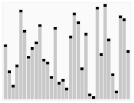

# Quick Sort

**Quick Sort** is an efficient sorting algorithm. For average scenarios, it is faster than **Insertion Sort** and **Selection Sort**. But for worst-case scenarios(eg. inversely sorted arrays), it performs similary to them. FYI: https://en.wikipedia.org/wiki/Quicksort.

Quick Sort relies on a concept called *partitioning*. The steps are as follows:

1. Take a random value from the array - which is called the **pivot**.
2. Move the items to make sure that that every number that is less than the pivot ends up to the left of the pivot, and that every number that is greater than the pivot ends up to the right of the pivot. We call these two arrays *sub-arrays*.
3. Repeate step 1 and 2 for the *sub-arrays* recursively until the array is sorted.

However, the pivot selection and partitioning steps can be done in various ways, which would affect the performance.

## Lomuto Partition

This scheme first picks a value as the pivot that is the last item in the array. Then it uses two indexes - i and j , to scan the array from the left end to the right end. Both i and j start from the left end. Then use j to iterate the items. If the item at j is less than the pivot, then swap array<sub>i</sub> and array<sub>j</sub>. At last, swap the pivot and array<sub>i</sub>. So all the items at the left side of the pivot are less than it, and all the items at the right side are greater than the pivot. Then recursively apply the same partitioning steps for the sub-arrays.

Here is the implementation of this algorithm:

``` cs --region quick-sort-lomuto-partition --source-file ../../src/FunCoding.LearnCSharpAlgorithms/Sorting/QuickSorter.cs --project ../../src/FunCoding.LearnCSharpAlgorithms/FunCoding.LearnCSharpAlgorithms.csproj

```

## Hoare Partition

Hoare Partition is another partitioning schema. It first takes a pivot from the array(there are multiple methods to select the pivot but in this case, for simplicity, let us say we use the right-most value as well), then uses two pointers that start at the left and right ends of the array, then move toward each other. The left pointer continuously moves one item to the right side until it reaches a value that is greater than or equal to the pivot. The right pointer continuously moves one item to the left side until it reaches a value that is less than or equal to the pivot. Then swap these two items that the left and right pointers are pointing to. Then continue this process. When they meet, swap the pivot with the value at the left pointer position. So we will get two sub-arrays. Then repeat the partitioning for the sub-arrays recursively until the array is sorted.

Here is the implementation for this one:

``` cs --region quick-sort-hoare-partition --source-file ../../src/FunCoding.LearnCSharpAlgorithms/Sorting/QuickSorter.cs --project ../../src/FunCoding.LearnCSharpAlgorithms/FunCoding.LearnCSharpAlgorithms.csproj

```

This is the animation for this algorithm:



## The Performance of Quick Sort

Actually there are some other factors that impact the performance of Quick Sort, such as how to select the pivot. But basically, the time complexity of Quick Sort is:

|            | Best-case scenario | Average-case scenario | Worst-case scenario |
| ---------- | ------------------ | --------------------- | ------------------- |
| Quick Sort | O(NLogN)           | O(NLogN)              | O(N<sup>2</sup>)    |

For most of cases, Quick Sort is faster than Insertion Sort and Selection Sort.

[Return to README](../../README.md)