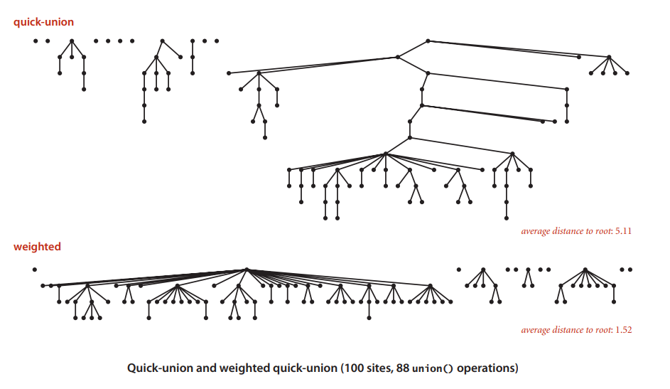

# Quick Union Improvements

We already know two methods for `Union Find` but unfortunately both them are not effective enough for huge numbers. How can we do better?

## Weighted Quick Union

Let us check `Quick Union`. When we connect two points, we did not consider the tree size. So it could have very tall trees. To make the improvement, we can take the tree size into account to avoid having tall trees. If we keep track of the size of each tree, we can always connect the small tree to the larger one. It is called `Weighted Quick Union`.


For this case, larger tree means it has more elements and smaller tree means it has less elements.

The weighted algorithm always makes sure to place the smaller tree down below of the larger tree. So the average distance to the root is much lower than the normal Quick Union algorithm.



To implement `Weighted Quick Union`, we need an extra array to count number of items in each tree. 

For `Find` and `Connected`, it is identical to `Quick Union`. We need to find the root point then check if `p` and `q` have the same root.

For `Ùnion` method, we will check the tree size of each item, then link the smaller tree to the root of the larger tree. Finally, we need to update the extra array to store the new count number for each tree.

The implementation of `Weighted Quick Union` is shown as below:

``` cs --region weighted-quick-union --source-file ../../src/FunCoding.LearnCSharpAlgorithms/UnionFind/WeightedQuickUnionUf.cs --project ../../src/FunCoding.LearnCSharpAlgorithms/FunCoding.LearnCSharpAlgorithms.csproj

```

You can run the test code:

``` cs --region weighted-quick-union --source-file ../../src/FunCoding.LearnCSharpAlgorithms/UnionFind/UnitFindClient.cs --project ../../src/FunCoding.LearnCSharpAlgorithms/FunCoding.LearnCSharpAlgorithms.csproj

```

Let us have a comparation:

| algorithm            | initialize | union  | find |
| -------------------- | ---------- | ------ | ---- |
| Quick Find           | N          | N      | 1    |
| Quick Union          | N          | N+     | N    |
| Weighted Quick Union | N          | logN + | logN |

(N+ means it includes cost of finding roots)

With this improvement, the depth of any node is at most logN. So it is acceptable for large scale problems.

## Weighted Quick Union with Path Compression

Can we improve it even further? Yes.

Because every time when we call `Union` or `Find` methods, we need to find the root of the item, so the length of the path is the key point for the performance. If we have as short path for each item, we would improvement it more. The idea is to flatten the tree. When we find the root of one item, we can make every item on that path just point to the root. We can use only one additional code to do that. Please check the `Find` method in the below code:
``` cs --region weighted-quick-union-path-compression --source-file ../../src/FunCoding.LearnCSharpAlgorithms/UnionFind/WeightedQuickUnionWithPathCompressionUf.cs --project ../../src/FunCoding.LearnCSharpAlgorithms/FunCoding.LearnCSharpAlgorithms.csproj

```
You can run the test code:

``` cs --region weighted-quick-union-path-compression --source-file ../../src/FunCoding.LearnCSharpAlgorithms/UnionFind/UnitFindClient.cs --project ../../src/FunCoding.LearnCSharpAlgorithms/FunCoding.LearnCSharpAlgorithms.csproj

```

With this improvement, the algorithm is very close to linear time algorithm. That means we can use it to solve huge problems. For example, if we have 10<sup>9</sup> unions and finds with 10<sup>9</sup> objects, it might take 30 years if we use `Quick Find`. A faster computer would not help much. But `Weighted Quick Union with Path Compression` can reduce time from 30 years to 6 seconds! That the magic of the algorithm.