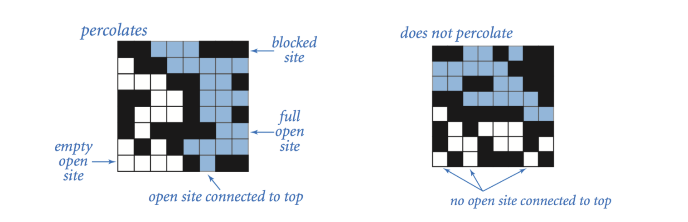
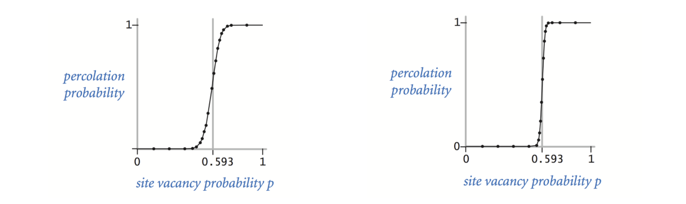

# Union-Find Applications

There are huge number of problems that can be solved by **Union-Find** algorithm. Let us look at one question called **percolation**. You can find it here: [Case Study: Percolation](https://introcs.cs.princeton.edu/java/24percolation/).

## Description

The below description is referenced from [Coursera](https://coursera.cs.princeton.edu/algs4/assignments/percolation/specification.php)

> **Percolation.** Given a composite systems comprised of randomly distributed insulating and metallic materials: what fraction of the materials need to be metallic so that the composite system is an electrical conductor? Given a porous landscape with water on the surface (or oil below), under what conditions will the water be able to drain through to the bottom (or the oil to gush through to the surface)? Scientists have defined an abstract process known as *percolation* to model such situations.
>
> **The model.** We model a percolation system using an *n*-by-*n* grid of *sites*. Each site is either *open* or *blocked*. A *full* site is an open site that can be connected to an open site in the top row via a chain of neighboring (left, right, up, down) open sites. We say the system *percolates* if there is a full site in the bottom row. In other words, a system percolates if we fill all open sites connected to the top row and that process fills some open site on the bottom row. (For the insulating/metallic materials example, the open sites correspond to metallic materials, so that a system that percolates has a metallic path from top to bottom, with full sites conducting. For the porous substance example, the open sites correspond to empty space through which water might flow, so that a system that percolates lets water fill open sites, flowing from top to bottom.)
>
> 
>
> **The problem.** In a famous scientific problem, researchers are interested in the following question: if sites are independently set to be open with probability *p* (and therefore blocked with probability 1 − *p*), what is the probability that the system percolates? When *p* equals 0, the system does not percolate; when *p* equals 1, the system percolates. The plots below show the site vacancy probability *p* versus the percolation probability for 20-by-20 random grid (left) and 100-by-100 random grid (right).
>
> 
>
> When *n* is sufficiently large, there is a *threshold* value *p** such that when *p* < *p** a random *n*-by-*n* grid almost never percolates, and when *p* > *p**, a random *n*-by-*n* grid almost always percolates. No mathematical solution for determining the percolation threshold *p** has yet been derived. Your task is to write a computer program to estimate *p**.

## Modeling

There is no mathematical solution for this problem yet so we have to make a simulation to find out the threshold. The algorithm we use for this problem must be fast enough. This simulation is called Monte Carlo simulation.

To implement this model, let us define an interface like this:

```csharp
    public interface IPercolation
    {
        void Open(int row, int col);
        bool IsOpen(int row, int col);
        bool IsFull(int row, int col);
        int NumberOfOpenSites();
        bool Percolates();
    }
```

In the implementation, we need to create a grid that contains n*n sites. By default all the sites are blocked. Then we randomly open some sites. As we keep going, every time we open a site, we check if it makes the system percolate. We can run this experiment many times to estimate the threshold. Actually, when we open a site, we need to check if its neighbors are open as well. If the neighbors are open, we need to connect them. It can be implemented by **Weighted Quick Union** described in the pervious article.

We can check whether any site in the top row is connected to any site in the bottom row. But the problem is this way is too expensive. Because for each site in the top row, we need to check each site in the bottom row so it is quadratic algorithm. This way is too slow for big problems.

Instead, we can create a virtual site on the top and on the bottom. So the problem is easier with these two virtual sites - we just need to check if the virtual top site is connected to the virtual bottom site. If we open a site that is in the first row, we need to connect it with the virtual top site. The same method can be applied to the sites that are in the bottom row. 

## Implementation

We can use a 2D array to represent the sites. 

```csharp
    public class Percolation : IPercolation
    {
        private readonly bool[,] _grid;
        private readonly int _gridSize;
        private int _openSites;
        private readonly int _virtualTop;
        private readonly int _virtualBottom;
        private readonly WeightedQuickUnionUf _wquGrid;

        public Percolation(int size)
        {
            _gridSize = size;
            _grid = new bool[size, size];
            _openSites = 0;
            var count = size * size;
            _wquGrid = new WeightedQuickUnionUf(count + 2);
            _virtualTop = count;
            _virtualBottom = count + 1;
        }

        public void Open(int row, int col)
        {
            Validate(row, col);
            if (IsOpen(row, col))
            {
                return;
            }
            var index = FindIndex(row, col);
            _grid[row - 1, col - 1] = true;
            _openSites++;

            if (row == 1)
            {
                _wquGrid.Union(_virtualTop, index);
            }
            else if (row == _gridSize)
            {
                _wquGrid.Union(_virtualBottom, index);
            }

            // Check up site
            if (IsInGrid(row -1, col) && IsOpen(row -1, col))
            {
                _wquGrid.Union(index, index - _gridSize);
            }
            // Check down site
            if (IsInGrid(row + 1, col) && IsOpen(row + 1, col))
            {
                _wquGrid.Union(index, index + _gridSize);
            }
            // Check left site
            if (IsInGrid(row, col - 1) && IsOpen(row, col - 1))
            {
                _wquGrid.Union(index, index - 1);
            }
            // Check right site
            if (IsInGrid(row, col + 1) && IsOpen(row, col + 1))
            {
                _wquGrid.Union(index, index + 1);
            }
        }

        public bool IsOpen(int row, int col)
        {
            Validate(row, col);
            return _grid[row - 1, col - 1];
        }

        public bool IsFull(int row, int col)
        {
            throw new NotImplementedException();
        }

        public int NumberOfOpenSites()
        {
            return _openSites;
        }

        public bool Percolates()
        {
            return _wquGrid.Find(_virtualTop) == _wquGrid.Find(_virtualBottom);
        }

        private int FindIndex(int row, int col)
        {
            return (row - 1) * _gridSize + col - 1;
        }

        private void Validate(int row, int col)
        {
            if (!IsInGrid(row, col))
            {
                throw new ArgumentException("row index or col index is invalid");
            }
        }

        private bool IsInGrid(int row, int col)
        {
            return row > 0 && row <= _gridSize && col > 0 && col <= _gridSize;
        }
    }
```

Then you can try to run the below code. You can change the size of the grid and run again then you will find the result is always around 59%. That is the threshold for this problem.

``` cs --region percolation --source-file ../../src/FunCoding.LearnCSharpAlgorithms/UnionFind/Percolation/PercolationClient.cs --project ../../src/FunCoding.LearnCSharpAlgorithms/FunCoding.LearnCSharpAlgorithms.csproj

```