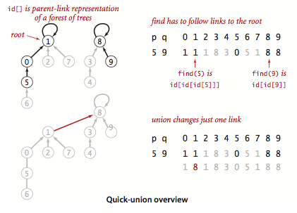

# Union-Find

Let us talk about the union find problem. You can find the description of this problem here: [Union-Find](https://algs4.cs.princeton.edu/15uf/).

> The below content is referenced from [Algorithms Fourth Edition](https://algs4.cs.princeton.edu/).
>
> ## Dynamic connectivity.
>
> The input is a sequence of pairs of integers, where each integer represents an object of some type and we are to interpret the pair `p q` as meaning `p` is connected to `q`. We assume that "is connected to" is an *equivalence relation*:
>
> - symmetric: If `p` is connected to `q`, then `q` is connected to `p`.
> - transitive: If `p` is connected to `q` and `q` is connected to `r` , then `p` is connected to `r`.
> - *reflexive*: `p` is connected to `p`.
>
> An equivalence relation partitions the objects into *equivalence classes* or *connected components*.
>
> Our goal is to write a program to filter out extraneous pairs from the sequence: When the program reads a pair `p q` from the input, it should write the pair to the output only if the pairs it has seen to that point do not imply that `p` is connected to `q`. If the previous pairs do imply that `p` is connected to `q`, then the program should ignore the pair `p q` and proceed to read in the next pair.


We will create an interface as shown below to represent the basic functionalities of it:

```csharp
    public interface IUnionFind
    {
        //protected int[] Id;
        ///// <summary>
        ///// The number of components
        ///// </summary>
        //protected int count;

        /// <summary>
        /// Add connection between p and q
        /// </summary>
        /// <param name="p">The p.</param>
        /// <param name="q">The q.</param>
        public void Union(int p, int q);

        /// <summary>
        /// Are p and q in the same component?
        /// </summary>
        /// <param name="p">The p.</param>
        /// <param name="q">The q.</param>
        /// <returns></returns>
        public bool Connected(int p, int q);

        /// <summary>
        /// Component identifier for p (0 to n - 1)
        /// </summary>
        /// <param name="p">The p.</param>
        /// <returns></returns>
        public int Find(int p);

        /// <summary>
        /// Number of components
        /// </summary>
        /// <returns></returns>
        public int Count();
    }
```

Keep in mind that the `n` could be huge. 

## Quick Find

**Quick Find** is an eager approach. We can use an integer array `id[]` of length `N` to represent the data structure. If and only if `p` and `q` have the same id, we can say `p` and `q` are connected.


For `Find` method, we can easily get the values for the given numbers then check if `p` and `q` have the same id.

For `Union` method, we need to change all entries whose id equals `id[p]` to `id[q]`.

 Then we can have the implementation like this:
``` cs --region quick-find --source-file ../../src/FunCoding.LearnCSharpAlgorithms/UnionFind/QuickFindUf.cs --project ../../src/FunCoding.LearnCSharpAlgorithms/FunCoding.LearnCSharpAlgorithms.csproj

```
The problem of this algorithm is the `Union` operation is too expensive. It takes N<sup>2</sup> array accesses to process a sequence of N union commands on N objects, which is a **Quadratic** algorithm. The `Find` operation is quick. So it is called `Quick Find`. We need to find a more efficient way to solve this problem.

You can run the code below:

``` cs --region quick-find --source-file ../../src/FunCoding.LearnCSharpAlgorithms/UnionFind/UnitFindClient.cs --project ../../src/FunCoding.LearnCSharpAlgorithms/FunCoding.LearnCSharpAlgorithms.csproj

```
## Quick Union

We will use the same `id[]` array to represent the data but we use another way to implement `Find` and `Union` actions. In this way, each item in the array is going to contain a reference to its parent - that means `id[i]` is the parent of `i`. If two items have the same root, we can say they are connected. The shape looks like a tree:



The root will point itself. In the above image, the parent of 0 is 1, and the parent of 1 is 1 so that means 1 is a root point. 

For `Find` method, we need to find the root point then check if `p` and `q` have the same root. 

For `Union` method, we will need to update the according root items. To merge components containing `p` and `q`, we need to set the id of `p`'s root to the id of `q`'s root. For example, when we union 5 and 9, we will find the root of 5 - which is 1, then find the root of 9 - which is 8, finally we will update `id[1]` to 8.

The implementation of `Quick Union` is shown as below:
``` cs --region quick-union --source-file ../../src/FunCoding.LearnCSharpAlgorithms/UnionFind/QuickUnionUf.cs --project ../../src/FunCoding.LearnCSharpAlgorithms/FunCoding.LearnCSharpAlgorithms.csproj

```
Because the `Union` operation of this algorithm is faster than `Quick Find` so it is called `Quick Union`. However, the `Find` operation is too expensive. It could be N array accesses for the worst case.
You can run the test code:
``` cs --region quick-union --source-file ../../src/FunCoding.LearnCSharpAlgorithms/UnionFind/UnitFindClient.cs --project ../../src/FunCoding.LearnCSharpAlgorithms/FunCoding.LearnCSharpAlgorithms.csproj

```

Let us have a comparation:

| algorithm   | initialize | union         | find |
| ----------- | ---------- | ------------- | ---- |
| Quick Find  | N          | N<sup>2</sup> | 1    |
| Quick Union | N          | N+            | N    |

(N+ means it includes cost of finding roots)

[Return to README](../../README.md)