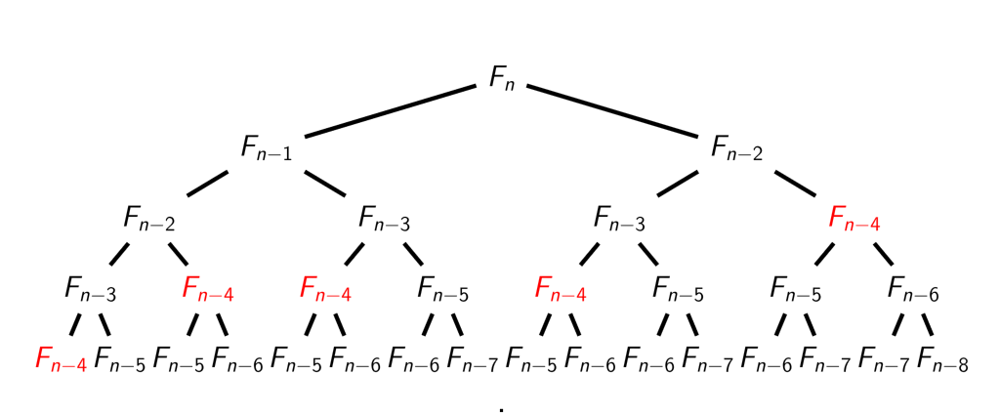

# Fibonacci Number

Next let us talk about Fibonacci Number, which is a magic number sequence. The definition of Fibonacci sequence is: 𝐹<sub>0</sub> = 0, 𝐹<sub>1</sub> = 1, and 𝐹<sub>𝑖</sub> = 𝐹<sub>𝑖</sub>−1 + 𝐹<sub>𝑖</sub>−2 for 𝑖 ≥ 2.

The beginning of the sequence is thus:

0, 1, 1, 2, 3, 5, 8, 13, 21, 34, 55, 89, 144... The numbers increase rapidly. Here are some examples:

F<sub>20</sub> = 6765

F<sub>50</sub> = 12586269025

F<sub>100</sub> = 354224848179261915075

F<sub>500</sub> = 139423224561697880139724382870407283950070256587697307264108962948325571622863290691557658876222521294125  

For more about it: [Fibonacci number](https://en.wikipedia.org/wiki/Fibonacci_number).

Our goal is to implement an efficient algorithm for computing Fibonacci Numbers.

> Task. Given an integer 𝑛, find the 𝑛th Fibonacci number 𝐹<sub>𝑛</sub>.
> 
> Input Format. The input consists of a single integer 𝑛.
> 
> Constraints. 0 ≤ 𝑛 ≤ 45.
> 
> Output Format. Output 𝐹<sub>𝑛</sub>  

If you have learned the basic program concepts, you may know *recursion*, which is a program technique to perform its task by delegating part of it to another instance of itself. I could not remember if my teacher showed us this example when I learned computer science in university. But it is helpful to understand recursion.

## Recursion Algorithm

If we want to get the number at F<sub>n</sub>, because it is the sum of F<sub>n-1</sub> and F<sub>n-2</sub>, so the recursive algorithm looks like this:

``` cs --region calculate-fibonacci-naive --source-file ../../src/FunCoding.LearnCSharpAlgorithms/Warmup/FibonacciNumber.cs --project ../../src/FunCoding.LearnCSharpAlgorithms/FunCoding.LearnCSharpAlgorithms.csproj

```

It works when we calculate small numbers. But if you try to calculate 40, you will feel the calculation is significantly slower. Why?

Let us use T(n) to denote the number of lines of code excuted by this algorithm. We can ignore the code that is used to check the argument because it is a constant value.

When n is less or equal to 1, T(n) is 2, because we only need to check if the value is less or equal to 1 then return the value. If n is 2, T(n) is also 2. But we still need to calculate F(1) and F(0). So when n is greater than 2, T(n) = 2 + T(n-1) + T(n-2). The time complexity of this algorithm is O(2<sup>n</sup>). That would be a super huge number when n grows. Actually, T(100) is about equal to 1.77*10<sup>21</sup>! It would take 56000 years on the 1GHz computer!

Why so slow?

Because in this algorithm, there are lots of duplicate computes:



You can see even we may have got the result of F(n), but it will be calculated many times, which definitely increases the running time.

## Improve the algorithm

We can reduce the running time by using a note to record the computed results. For example, if we have got the result of F(n), next time we can just retrieve the result from the note. Let us improve the recursion algorithm.

``` cs --region calculate-fibonacci-note --source-file ../../src/FunCoding.LearnCSharpAlgorithms/Warmup/FibonacciNumber.cs --project ../../src/FunCoding.LearnCSharpAlgorithms/FunCoding.LearnCSharpAlgorithms.csproj

```

Try to run the above code, you will see it is much faster!

In the above algorithm, we use a note to reduce the count of duplicate computes. Because we only compute F(n) once, so the time complexity of this algorithm is O(N). It is a huge improvement!

## Another fast algorithm

We can also use another algorithm for this question. Because we know F<sub>n</sub> = F<sub>n-1</sub> + F<sub>n-2</sub>, we can start to calculate F<sub>2</sub> from F<sub>0</sub> and F<sub>1</sub>, then F<sub>3</sub> from F<sub>1</sub> and F<sub>2</sub>... etc.

Here is another fast algorithm by creating an array:

``` cs --region calculate-fibonacci-array --source-file ../../src/FunCoding.LearnCSharpAlgorithms/Warmup/FibonacciNumber.cs --project ../../src/FunCoding.LearnCSharpAlgorithms/FunCoding.LearnCSharpAlgorithms.csproj

```

The time complexity of this algorithm is also O(N). It is much better. But actually, we do not need to create the array because we only need the last number. So we can continue to improve it by removing the array:

``` cs --region calculate-fibonacci-without-array --source-file ../../src/FunCoding.LearnCSharpAlgorithms/Warmup/FibonacciNumber.cs --project ../../src/FunCoding.LearnCSharpAlgorithms/FunCoding.LearnCSharpAlgorithms.csproj

```

This improvement does not change the time complexity but it indeed reduces the space complexity since it does not need to create the array.

## Wrapping up

From this example, I hope we can learn how we improve the algorithms step by step. Keep in mind that there might be multiple algorithms to solve the same problem. Our goal is to find out the proper one that fits current scenario.

[Return to README](../../README.md)